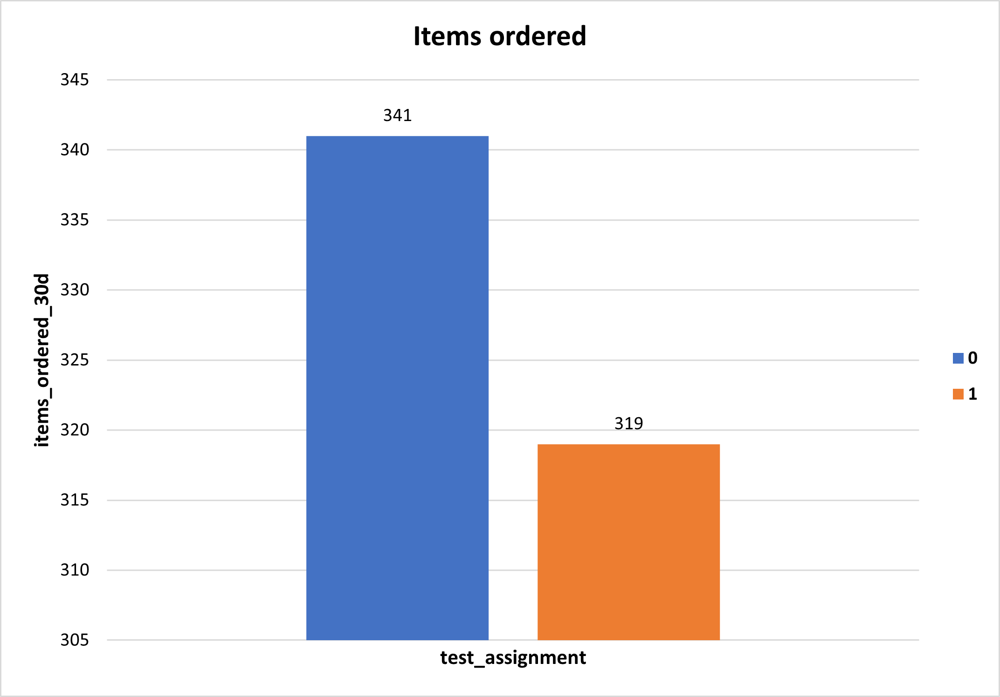
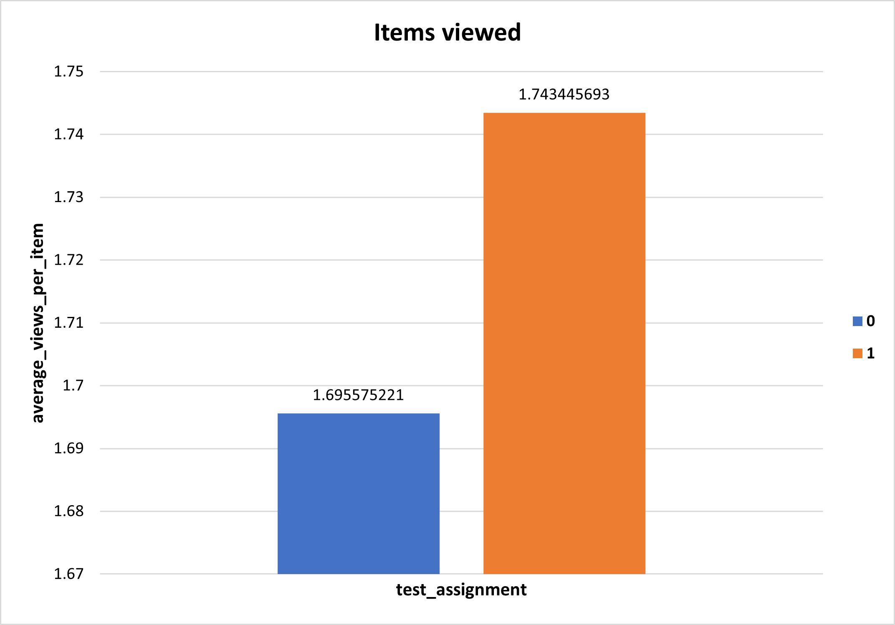

# Data Wrangling, Analysis and AB Testing with SQL

## Assignment Tasks
We are running an experiment at an item-level, which means all users who visit will see the same page, but the layout of different item pages may differ. Please follow the steps below and good luck!

1. Compare the final_assignments_qa table to the assignment events we captured for user_level_testing. Write an answer to the following question: Does this table have everything you need to compute metrics like 30-day view-binary?

2. Write a query and table creation statement to make final_assignments_qa look like the final_assignments table. If you discovered something missing in part 1, you may fill in the value with a place holder of the appropriate data type.

3. Use the final_assignments table to calculate the order binary for the 30 day window after the test assignment for item_test_2 (You may include the day the test started)

4. Use the final_assignments table to calculate the view binary, and average views for the 30 day window after the test assignment for item_test_2. (You may include the day the test started)

5. Use the https://thumbtack.github.io/abba/demo/abba.html to compute the lifts in metrics and the p-values for the binary metrics ( 30 day order binary and 30 day view binary) using a interval 95% confidence.

6. Use Mode’s Report builder feature to write up the test. Your write-up should include a title, a graph for each of the two binary metrics you’ve calculated. The lift and p-value (from the AB test calculator) for each of the two metrics, and a complete sentence to interpret the significance of each of the results.

### A/B Testing Results
    Order binary
    There is no detectable change in this metric. The p-value is 0.86 meaning that there is a no significant difference in the number of orders within 30days of the assigned treatment date between the two treatments.
  

    
  

    View Binary 
    We can say with 95% confidence that the lift value is 2% and the p_value is 0.2. 
    There is not a significant difference in the number of views within 30days of the assigned treatment date between the two treatments.
  

    
  
  